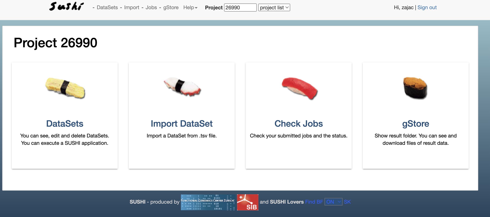
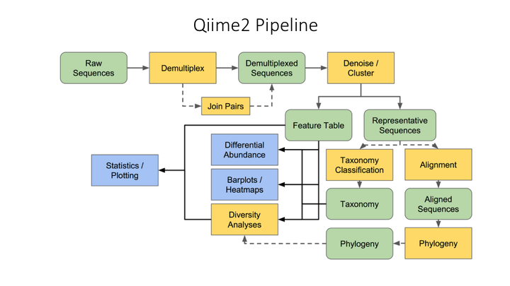

# Metagenomics course at FGCZ

Welcome to the Metagenomics Course!

Table of contents:
* [Schedule]()
* [Course slides](): sign in with your bfabric credentials to see the contents. The contents are divided into each day of the course.
* [Course in the Bfabric](https://fgcz-bfabric.uzh.ch/bfabric/project/show.html?id=29934&tab=details): here you can find all the communication.

For more information please see the description of each Day.

## Day 1: Introduction and 16S analysis

### SUSHI instructions - How to get there

Go to [https://fgcz-course1.bfabric.org/](https://fgcz-course1.bfabric.org/)

You will end up on a page like this, not exactly like this but the same outline:

In the top right corner (window "Project") enter your project number.
Here are your project numbers:

6000 - Magdalena Adamczyk\
6001 - Irene Artuso\
6002 - Ali Bektas\
6003 - Alyssa Deluz\
6004 - Pamela Guerillot\
6005 - Monica Iachizzi\
6006 - Marco LaFortezza\
6007 - Martin Niamh\
6008 - Tristan Nolan\
6009 - Rhowell Tiozon\
6010
6011

Exercise instructions:

### FastQC

First thing to be done when you get your raw data is run quality control tests. There are many tools available out there but today we are going to run FastQC.
Please look at the following slides to run the FastQC tutorial.

* [FastQC tutorial link](FastQC.pptx)

### QIIME2 analysis on SUSHI

For 16S rRNA analysis we will use a dataset from the Earth Microbiome Project. 
You need to go to SUSHI (see: SUSHI instructions - How to get there) and enter your project. In the project you will find a dataset labelled 16S_EarthMicrobiome. Enter this dataset.
Now you need to run QIIME2 on the dataset. How to do that? Download the powerpoint instructions below.

* [Powerpoint instructions on how to run QIIME2](QIIME2.pptx)

Once you have completed running QIIME2, have a look at the reports. You will have a following list of reports:

Statis Report - this is a combined report of all analysis with fixed/non interactive graphs\
Demux Report - a QIIME2 interactive report of demultiplexed sequence counts and data quality\
Denoising Stats - a QIIME2 table on the filtered reads at each step\
Feature Table - a QIIME2 interactive report on ASV summary \
Rep Seqs - a QIIME2 table on all features - if you click a feature it will take you to BLAST\
Taxonomy Barplot - a QIIME2 interactive barplot showing the taxonomy\
Taxonomy - a QIIME2 table of all the ASVs and their taxonomic classification\
Shannon Diversity - a QIIME2 interactive report of alpha diversity \
Jaccard diversity - a QIIME2 interactive report of beta diversity (jaccard) \
Bray Curtis Diversity - a QIIME2 interactive report of beta diversity (bray curtis) \
Jaccard Emperor Plot - a QIIME2 interactive 3D PCA based on Jaccard Matrix \
Bray Curtis Emperor Plot - a QIIME2 interactive 3D PCA based on Bray Curtis Matrix \ 
Alpha Rarefaction - a QIIME2 interactive plot showing rarefaction curve \
Differential abundance - a QIIME2 interactive report on results of ANCOM\

All these reports refer to the following workflow:

Once you familirized yourself with the reports please fill in the following tutorial based on the data, you will need your bfabric login:

* [Tutorial on Earth Microbiome data](https://fgcz-shiny.uzh.ch/QIIME2_EarthMicrobiome/)

## Day 2: Metagenomics

### How to log into the cluster
### Metagenome Atlas Tutorial 1

## Day 3: Metagenomics and Metatranscriptomics

### Metagenome Atlas Tutorial 2
### Kraken2 tutorial
### Samsa2 tutorial

