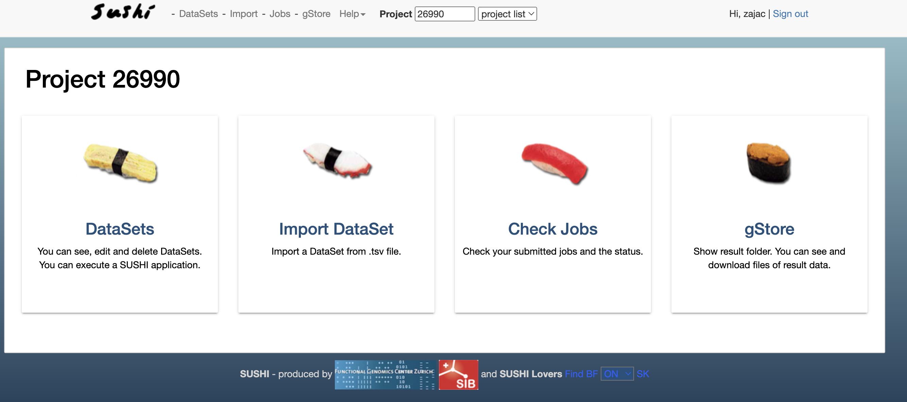
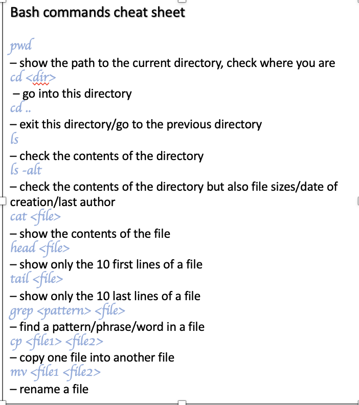
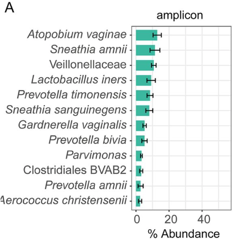

# Metagenomics course at FGCZ

Welcome to the Metagenomics Course!

Table of contents:
* [Schedule](SChedule_Metagenomics_March2023.pdf)
* [Course slides](slides/)
* [Course in the Bfabric](https://fgcz-bfabric.uzh.ch/bfabric/project/show.html?id=29934&tab=details): here you can find all the communication.

For more information please see the description of each Day.

## Day 1: Introduction and 16S analysis

Today we start with an introductory lecture. This will be followed by a short excercise. In order to complete the excercises you will need SUSHI.

### SUSHI instructions - How to get there

Go to [https://fgcz-course1.bfabric.org/](https://fgcz-course1.bfabric.org/)

You will end up on a page like this, not exactly like this but the same outline:

In the top right corner (window "Project") enter your project number.
Here are your project numbers:

6001
6002
6003 
6004
6005 
6006 
6007
6008
6009
6010 

Exercise instructions:

### FastQC

First thing to be done when you get your raw data is run quality control tests. There are many tools available out there but today we are going to run FastQC.
Please look at the following slides to run the FastQC tutorial.

* [FastQC tutorial link](instructions/FastQC.pptx)

Now that we have completed the excercises we will go on to a lecture on 16S. We will then have a guest talk from a researcher using 16S in her forensic science research. Afterwards we will do an excercises using QIIME2.

### QIIME2 analysis on SUSHI

The software we will use for analysing our 16S rRNA datasets is QIIME2. For more info please see: https://docs.qiime2.org/2023.2/. We will use a dataset from the Earth Microbiome Project as discussed. 
You need to go to SUSHI (see: SUSHI instructions - How to get there) and enter your project. In the project you will find a dataset labelled 16S_EarthMicrobiome. Enter this dataset.
As this is going to be a group project, you need a person to pair up with. Please form groups of 2. Now you need to run QIIME2 on the dataset and each one of you needs to run it using a different grouping variable. How to do that? Download the powerpoint instructions below.

* [Powerpoint instructions on how to run QIIME2](instructions/QIIME2.pptx)

Once you have completed running QIIME2 (the run might take around 20min), have a look at the reports. You will have a following list of reports:

Statis Report - this is a combined report of all analysis with fixed/non interactive graphs\
Demux Report - a QIIME2 interactive report of demultiplexed sequence counts and data quality\
Denoising Stats - a QIIME2 table on the filtered reads at each step\
Feature Table - a QIIME2 interactive report on ASV summary \
Rep Seqs - a QIIME2 table on all features - if you click a feature it will take you to BLAST\
Taxonomy Barplot - a QIIME2 interactive barplot showing the taxonomy\
Taxonomy - a QIIME2 table of all the ASVs and their taxonomic classification\
Shannon Diversity - a QIIME2 interactive report of alpha diversity \
Jaccard diversity - a QIIME2 interactive report of beta diversity (jaccard) \
Bray Curtis Diversity - a QIIME2 interactive report of beta diversity (bray curtis) \
Jaccard Emperor Plot - a QIIME2 interactive 3D PCA based on Jaccard Matrix \
Bray Curtis Emperor Plot - a QIIME2 interactive 3D PCA based on Bray Curtis Matrix \ 
Alpha Rarefaction - a QIIME2 interactive plot showing rarefaction curve \
Differential abundance - a QIIME2 interactive report on results of ANCOM

All these reports refer to the following workflow:

Once you familirized yourself with the reports please fill in the following tutorial based on the data, you will need your bfabric login:

* [Tutorial on Earth Microbiome data](https://fgcz-shiny.uzh.ch/QIIME2_EarthMicrobiome/)

If you are interested in what qiime2 commands have been run on the dataset have a look at this document:

* [QIIME2 commands](unifiedQIIME2Workflow.singleend.batch)

### Bonus exercise - paired end sequencing

If you are done with that and you have time, there is a bonus exercise. There is another dataset the two of you can analyse and answer related questions. Lets begin! 
Go back to your project in SUSHI and select a dataset called 16S_SchlossMice. Enter this dataset. You will see it has 20 samples and the data refers to a study Schloss et al. 2012 (https://www.tandfonline.com/doi/full/10.4161/gmic.21008
). What to do with this dataset? See the powerpoint presentation below:

* [Powerpoint instructions on how to run QIIME2 Bonus exercise](instructions/QIIME2_Bonus.pptx)

Once you familirized yourself with the reports please fill in the following tutorial based on the data, you will need data from both factors to answer the questions together:

* [Tutorial on Schloss Mice data](https://fgcz-shiny.uzh.ch/QIIME2_Schloss_Mice/)

At the end we can discuss the answers together so if anything is unclear - keep it in mind!

## Day 2: Metagenomics

You made it to Day 2 ;)! Today first we will have a project discussion followed by an special event (8:15 - 11:00). 
After that we will talk about metagenomic analyses and I will give a short intro (11:00 - 12:00). We will also have a guest lecture from the creator of Metagenome Atlas (13:00 - 14:00). 
Afterwards we will do some analyses using Metagenome Atlas. In order to do the first part you will need to use the command line.

### How to log into the cluster - NEEDED FOR FIRST PRACTICAL

First, before you begin the practical you need to be able to log in to the cluster. Click on the instructions below where you will find an explanation on how to do that. The instructions are different whether you have a mac or a windows computer. 

* [How to log in to cluster MAC](instructions/mac_cluster.md)
* [How to log in to cluster WINDOWS](instructions/window_cluster.md)

### Metagenome Atlas Tutorial 1

If you find yourself in a place that looks like this (except with your name and perhaps a different server):

then you are good to go! Now you have to follow the following tutorial. During the tutorial you will be creating new folders and files. Sometimes you want to see what is within your whole directory. You can do that by typing 'ls -alt *'
Otherwise if you need any help on how to navigate, here is a bash cheet sheet. Using these commands you can enter new directories, open files and exit directories:

You can find the tutorial here: https://fgcz-shiny.uzh.ch/Metagenome_Atlas_Part1/

## Day 3: Metagenomics and Metatranscriptomics

Again busy day ahead of us. But don't worry, last day! Today we first follow the tutorial on Metagenome Atlas but the second one this time. You don't need to log into the cluster like you did before. Everything is R based.

### Metagenome Atlas Tutorial 2

For this tutorial you will have to set up an account on posit- Sign up with google or Github. You will find all information within the tutorial on how to do it. 
You can find the precise instructions and the tutorial here: https://fgcz-shiny.uzh.ch/Metagenome_Atlas_Part2/

Now that we have explored assembly-based metagenomics, lets explore assembly-free metagenomics and metatranscriptomics. A tool that we will use for assembly-free metagenomics is Kraken2. We will look at the theory behind Kraken and do a tutorial. We will produce an html report using Krona. 
Afterwards we will turn to Metatranscriptomics (see more info below).

### Kraken2 tutorial

You will run Kraken on SUSHI. If you would like a reminder on where to go, see above. Otherwise please follow the following tutorial. 

* [Kraken Tutorial](instructions/Kraken.pptx)

Keep in mind we are looking at a dataset that we worked on during Metagenome Atlas Part 1 tutorial. We did not find out which genomes we were acutally assembling. But perhaps we can find out using Kraken. You are looking for 2 genomes in sample1 and 3 genomes in sample2. 

  
Check for Answers here!

  
  ### Sample Content
  1. Sample1: Mesomycoplasma hyorhinis, Streptococcus thermophilus
  2. Sample2: Mesomycoplasma hyorhinis, Ureaplasma urealyticum, Streptococcus thermophilus

An an introduction to metatranscriptomics is best began with a lecture from a guest on metaproteomics. This will be followed by a talk on the theory behind metatranscriptomics and a tutorial where we are going to use software called Samsa2.

### Samsa2 tutorial

Now tutorial! We will also use SUSHI and we will run a report on SAMSA2 analysis. See below for exact instructions.

* [Samsa2 Tutorial](instructions/Samsa2.pptx)

There are several questions we will discuss after you familiarize yourself with the output. Have a detailed look at what the graphs are showing.
Here are the questions:

- Is species/functional diversity (richness and evenness) higher before or after
medication and do you observe the same trends in both patient groups?
 - What species dominate the vaginal microbiome before the application of
medication and what after the application of medication? Do you observe
differences in time point 1 between patients that did and did not respond to
treatment in terms of species? Do you think any of this can explain lack of the
response
- What is log2Fold change in transcript abundance from those species before and
after medication in both patient groups?
- 16S results were different. Why do you think that is?

- Which functions have clearly been upregulated/downregulated in the microbiome
after successful curing of BV? Do you know anything about these functions? Could
you explain what has been happening?
- What functions do you see upregulated or downregulated in the microbiome of
patients who were not successfully treated? Are there any parallels with the cured
patients? Does anything interesting strike you?

Lets discuss.

THANK YOU AND CONGRATULATIONS FOR COMPLETING THE COURSE!!!
